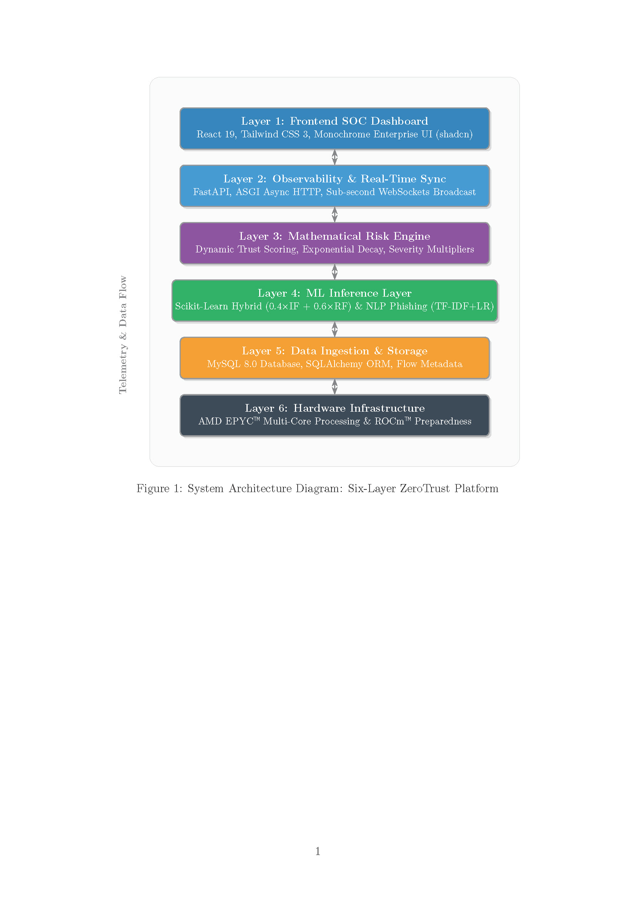
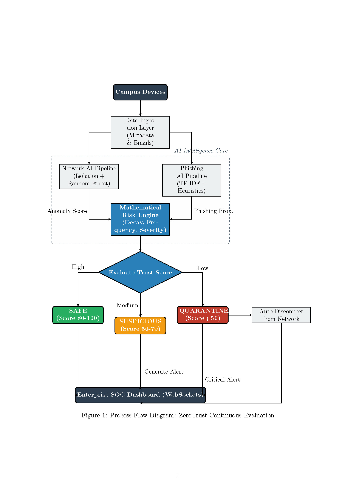
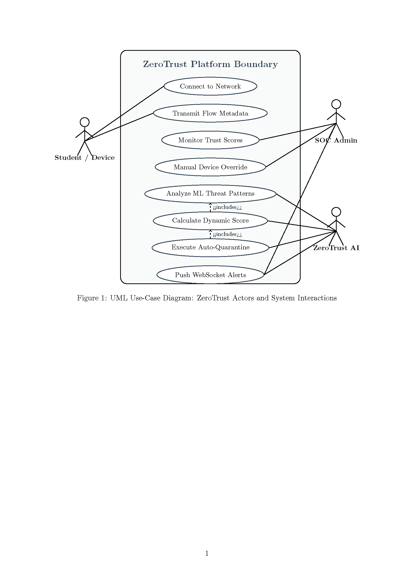

<p align="center">
  <h1 align="center">ZeroTrust</h1>
  <p align="center"><strong>AI-Driven Cybersecurity Intelligence Platform for Zero-Trust Network Enforcement</strong></p>
  <p align="center">
    Hybrid Machine Learning · Dynamic Trust Scoring · Real-Time Threat Detection · AMD-Optimized Inference
  </p>
</p>

<p align="center">
  
  
  
  
  
  
  
</p>

---

## Table of Contents

1. [Executive Summary](#1-executive-summary)
2. [System Architecture](#2-system-architecture)
3. [Process Flow](#3-process-flow)
4. [Use Cases](#4-use-cases)
5. [Machine Learning Design](#5-machine-learning-design)
6. [Hybrid Detection Pipeline](#6-hybrid-detection-pipeline)
7. [Risk Engine — Mathematical Model](#7-risk-engine--mathematical-model)
8. [Performance Benchmarks](#8-performance-benchmarks)
9. [Scalability & AMD Optimization](#9-scalability--amd-optimization)
10. [Security & Hardening](#10-security--hardening)
11. [Deployment Guide](#11-deployment-guide)
12. [API Reference](#12-api-reference)
13. [Limitations & Design Choices](#13-limitations--design-choices)
14. [Future Roadmap](#14-future-roadmap)

> **Full Technical Specification:** See [README_DETAILED.md](README_DETAILED.md) for the complete 1,000+ line technical reference — including threat model, simulation engine, observability layer, false positive mitigation strategy, and SOC dashboard architecture.

---

## 1. Executive Summary

ZeroTrust is an **AI-driven cybersecurity intelligence platform** that implements continuous, automated Zero-Trust enforcement across campus-scale networks. Every device, every flow, and every communication is treated as potentially hostile — the system computes a **dynamic trust score** for each endpoint in real time using a hybrid machine learning pipeline and enforces automated quarantine when trust degrades.

**Why this matters:** The average data breach costs **$4.88M** and takes **194 days** to detect (IBM, 2024). Organizations with automated security orchestration cut costs by **$2.22M** and detect threats **108 days faster**. ZeroTrust reduces detection-to-containment to **sub-second** timescales.

### Key Results

| Metric | Network (Hybrid IF+RF) | Phishing (TF-IDF+LR) |
|---|---|---|
| Accuracy | 99.89% | 97.93% |
| F1 Score | 0.9982 | 0.9801 |
| ROC-AUC | 0.9999 | 0.9981 |
| Detection Rate | 100% (at τ=0.5) | — |
| False Positive Rate | 0.15% | — |

### Technology Stack

| Layer | Technology | Role |
|---|---|---|
| **API** | FastAPI 0.115, Uvicorn (ASGI) | Async HTTP + WebSocket |
| **Auth** | JWT (HS256) + bcrypt + RBAC | Token auth, admin/analyst roles |
| **ML** | scikit-learn 1.6, NumPy, SciPy | IF + RF + TF-IDF + LR |
| **Database** | MySQL 8.0, SQLAlchemy 2.x | Device state, audit trail, risk history |
| **Frontend** | React 19, Tailwind CSS 3 | Monochrome SOC dashboard |
| **Real-time** | WebSocket (native FastAPI) | Sub-second event streaming |
| **Deployment** | Docker Compose | MySQL + Backend + Nginx |

---

## 2. System Architecture

ZeroTrust implements a **six-layer pipeline architecture** where data flows upward from hardware infrastructure through ML inference to the SOC dashboard, with telemetry feeding back at every stage.

<p align="center">
  
</p>
<p align="center"><em>Figure 1: System Architecture — Six-Layer ZeroTrust Platform</em></p>

| Layer | Components | Responsibility |
|---|---|---|
| **Layer 1** | React 19, Tailwind CSS, shadcn | Frontend SOC Dashboard |
| **Layer 2** | FastAPI, ASGI, WebSockets | Observability & Real-Time Sync |
| **Layer 3** | Risk Engine (236 lines) | Dynamic Trust Scoring, Exponential Decay, Severity Multipliers |
| **Layer 4** | scikit-learn Hybrid (0.4×IF + 0.6×RF), TF-IDF+LR | ML Inference Layer |
| **Layer 5** | MySQL 8.0, SQLAlchemy ORM | Data Ingestion & Storage |
| **Layer 6** | AMD EPYC / Ryzen Multi-Core, ROCm Readiness | Hardware Infrastructure |

### End-to-End Data Flow

```
1. Device sends network flow         → API receives 52-feature vector
2. Isolation Forest scores anomaly   → IF_score = 0.69
3. Random Forest classifies attack   → RF_prob = 0.98 (DDoS)
4. Hybrid fusion                     → 0.4×0.69 + 0.6×0.98 = 0.864
5. Risk engine applies severity      → DDoS multiplier = 1.5×
6. Penalty calculated                → 45.0 × 1.5 × 1.0 = 67.5
7. Trust score updated               → 100 − 67.5 = 32.5
8. 32.5 < QUARANTINE_THRESHOLD (50)  → Status: QUARANTINED
9. WebSocket broadcasts alert        → SOC dashboard updates in <1s
```

**Ingestion to quarantine: < 500ms** (single-sample P95 = 383ms + risk engine + DB write).

---

## 3. Process Flow

The following diagram illustrates ZeroTrust's continuous evaluation loop — from campus device ingestion through the AI intelligence core to automated enforcement and SOC alerting.

<p align="center">
  
</p>
<p align="center"><em>Figure 2: Process Flow — ZeroTrust Continuous Evaluation</em></p>

**Three enforcement tiers:**

| Trust Score | Status | Automated Action |
|---|---|---|
| ≥ 80 | **SAFE** | Normal network access |
| 50 – 79 | **SUSPICIOUS** | Enhanced monitoring, alert generated |
| < 50 | **QUARANTINED** | Automatic device isolation, critical SOC alert |

The mathematical risk engine (§7) computes trust scores using exponential time-decay, sliding-window frequency escalation, severity weighting, and rolling-average smoothing — ensuring that quarantine decisions are deterministic, interpretable, and auditable.

---

## 4. Use Cases

<p align="center">
  
</p>
<p align="center"><em>Figure 3: UML Use-Case Diagram — Actors and System Interactions</em></p>

### Actors

| Actor | Role |
|---|---|
| **Student / Device** | Campus endpoint — connects, transmits flow metadata, monitors trust score |
| **SOC Admin** | Security operator — monitors trust scores, overrides device status, investigates alerts |
| **ZeroTrust AI** | Autonomous agent — analyzes threats, computes scores, executes quarantine, pushes alerts |

### Interaction Summary

| Use Case | Actors Involved | Description |
|---|---|---|
| Connect to Network | Student/Device | Endpoint joins campus network |
| Transmit Flow Metadata | Student/Device | Flow-level features sent to ingestion layer |
| Monitor Trust Scores | Student/Device, SOC Admin | Real-time trust visibility via dashboard |
| Manual Device Override | SOC Admin | Quarantine or release devices manually |
| Analyze ML Threat Patterns | ZeroTrust AI | Hybrid IF+RF + phishing detection |
| Calculate Dynamic Score | ZeroTrust AI | Risk engine trust computation |
| Execute Auto-Quarantine | ZeroTrust AI | Isolate compromised devices autonomously |
| Push WebSocket Alerts | ZeroTrust AI, SOC Admin | Real-time alert delivery to dashboard |

---

## 5. Machine Learning Design

### 5.1 Network Anomaly Detection

**Dual-model pipeline** trained on CICIDS-2017 (100K stratified samples, 52 flow features):

| Component | Model | Key Config | Purpose |
|---|---|---|---|
| **Model A** | Isolation Forest | 200 trees, contamination=0.01, normal-only training | Unsupervised novelty detection |
| **Model B** | Random Forest | 200 trees, depth=20, balanced class weights | Supervised attack classification |

**Reproducibility:** Train/test = 80/20 (stratified), `random_state=42` across all operations.

| Model | Accuracy | Precision | Recall | F1 | ROC-AUC |
|---|---|---|---|---|---|
| Isolation Forest | — | 87.57% | 16.96% | — | 0.821 |
| Random Forest | 99.91% | 99.84% | 99.87% | 0.9985 | 0.9996 |
| **Hybrid (IF+RF)** | **99.89%** | **99.87%** | **99.76%** | **0.9982** | **0.9999** |

> **Note on high AUC:** CICIDS-2017 exhibits strong feature separability between benign and attack flows. Near-perfect RF discrimination is consistent with published benchmarks on this dataset. Validation on newer datasets (CIC-IDS-2018, UNSW-NB15) is required.

### 5.2 Phishing Detection

**NLP + structural feature fusion** trained on 8 corpora (~50K emails):

| Feature Type | Details |
|---|---|
| **TF-IDF** | 10K vocabulary, unigram + bigram, English stop words |
| **12 Structural Features** | URL count, IP URLs, suspicious TLDs, urgency ratio, HTML forms/links, character entropy, caps ratio, etc. |
| **Combined** | ~10,012 dimensions via sparse hstack |

| Model | Accuracy | F1 | ROC-AUC |
|---|---|---|---|
| Baseline (TF-IDF only) | 97.97% | 0.9805 | 0.998 |
| **Enhanced (+structural)** | **97.93%** | **0.9801** | **0.9981** |

### 5.3 Why Not Deep Learning?

A deliberate engineering choice:

| Concern | Classical ML (Current) | Deep Learning |
|---|---|---|
| **Inference latency** | 3–215 ms | 50–500+ ms |
| **Deployment** | CPU-only, no GPU required | Requires CUDA/ROCm runtime |
| **Interpretability** | Feature importance, decision paths | Black-box (SHAP/LIME needed) |
| **Training data** | 100K samples sufficient | Typically 1M+ needed |
| **Model size** | ~50 MB | 500 MB – 2 GB |
| **Cost** | Any commodity CPU | GPU instance ($0.50–$3/hr) |

The architecture is designed to incorporate deep learning (GNN, transformers) in future versions when operational scale justifies the complexity.

---

## 6. Hybrid Detection Pipeline

The network subsystem fuses both models via a weighted hybrid score:

```
hybrid_score = 0.4 × IF_score + 0.6 × RF_probability
```

| Weight | Model | Justification |
|---|---|---|
| 0.4 | Isolation Forest | Captures novelty — zero-day-like patterns outside training distribution |
| 0.6 | Random Forest | Captures known attack signatures with near-perfect recall (99.87%) |

**Decision threshold:**

```
anomaly_detected = True  if  prediction == −1  OR  hybrid_score > 0.5
```

| Population | Mean Hybrid Score | Detection Rate | FPR |
|---|---|---|---|
| Normal traffic | 0.006 | — | 0.15% |
| Attack traffic | 0.996 | 100% | — |

The separation between normal (μ=0.006) and attack (μ=0.996) populations is nearly **three orders of magnitude**, indicating strong discriminative power.

---

## 7. Risk Engine — Mathematical Model

The Risk Engine translates raw ML outputs into an actionable trust score. Fully deterministic and unit-testable (236 lines in `engine/risk_engine.py`).

### Trust Score Formula

$$Trust(t) = BASE - \sum(Penalty_i \times Severity_i \times FrequencyEscalation)$$

Where `BASE = 100` (maximum trust for a clean device).

### Exponential Time-Decay

$$decay(\Delta t) = 2^{-\Delta t / T_{half}}$$

| Parameter | Value | Effect |
|---|---|---|
| Half-life | 300s (5 min) | Event at t−5min = 50% weight |
| At t−10min | — | 25% weight |
| At t−20min | — | 6.25% weight |

### Sliding-Window Frequency Escalation

10-minute window with linear escalation above threshold:

| Events in Window | Escalation |
|---|---|
| ≤ 3 | 1.0× |
| 6 | 1.43× |
| 10+ | 2.0× (max) |

### Severity Multipliers

| Attack Type | Multiplier | Rationale |
|---|---|---|
| Data Exfiltration | 1.8× | Direct data loss |
| C2 Communication | 1.6× | Active compromise |
| DDoS | 1.5× | Service disruption |
| Web Attack | 1.4× | Application-layer compromise |
| Insider Threat | 1.4× | Trusted entity acting maliciously |
| Brute Force | 1.3× | Credential compromise attempt |
| Phishing | 1.2× | Entry vector |
| Port Scan | 1.1× | Reconnaissance |

### Rolling Average Smoothing

```
final_score = 0.7 × current_score + 0.3 × rolling_average(recent_scores)
```

Prevents single-event oscillation — a historically clean device is minimally affected by isolated false positives.

---

## 8. Performance Benchmarks

All benchmarks measured via automated suite (`benchmark.py`, 340 lines). 5-iteration warm-up, 50-sample aggregation.

### Inference Latency (Single Sample)

| Pipeline | Mean | Median | P95 | P99 |
|---|---|---|---|---|
| **Network (IF+RF)** | 214.6 ms | 195.1 ms | 383.4 ms | 498.6 ms |
| **Phishing (TF-IDF+LR)** | 3.1 ms | 2.6 ms | 7.3 ms | 8.0 ms |

### Batch Throughput

| Batch Size | Threads | Network (samples/s) | Phishing (samples/s) |
|---|---|---|---|
| 50 | 1T | 4.8 | 248.4 |
| 50 | 4T | 6.2 | 253.9 |
| 100 | 2T | 4.6 | 214.6 |
| 100 | 4T | 4.7 | 197.2 |

### Test Suite

```
pytest:    31/31 passing
API:       20/20 endpoint tests
Browser:    4/4  dashboard views (Playwright)
```

---

## 9. Scalability & AMD Optimization

### Multi-Core Thread Scaling

Batch inference uses `ThreadPoolExecutor` optimized for AMD multi-core architectures:

| Threads | Network (samples/s) | Speedup | Phishing (samples/s) | Speedup |
|---|---|---|---|---|
| 1 | 4.6 | 1.00× | 317.9 | 1.00× |
| 2 | 7.1 | 1.55× | 305.1 | 0.96× |
| 4 | 7.2 | 1.56× | 288.0 | 0.91× |
| 8 | 6.1 | 1.32× | 179.4 | 0.56× |
| 12 | 8.6 | **1.87×** | 415.4 | **1.31×** |

Network inference scales well to 12 threads — Random Forest's tree evaluation is embarrassingly parallel across AMD cores. The 8-thread dip is likely attributable to Python GIL contention and memory bandwidth saturation.

### AMD Hardware Acceleration Roadmap

| Phase | Capability | Expected Impact |
|---|---|---|
| **Current** | ThreadPoolExecutor multi-core | 1.87× at 12T (measured) |
| **Next** | AMD ROCm GPU (RF → GPU ensemble) | 5–10× throughput |
| **Future** | AMD Ryzen AI NPU (XDNA) | Sub-ms latency, <5W TDP |
| **Future** | ONNX Runtime + ROCm EP | Framework-agnostic GPU/NPU |

---

## 10. Security & Hardening

| Control | Implementation |
|---|---|
| **Authentication** | JWT (HS256), 60-min expiry |
| **Password Storage** | bcrypt (adaptive cost) |
| **RBAC** | admin / analyst roles |
| **Rate Limiting** | 120 req/min API, 10/min auth |
| **CORS** | Configurable origin whitelist |
| **Input Validation** | Pydantic v2 schemas |
| **SQL Injection** | SQLAlchemy ORM (parameterized) |
| **Connection Pooling** | Pool=10, overflow=20, pre-ping |
| **Transport** | HTTPS via Nginx (TLS termination) |
| **Secrets** | Environment variables only |

---

## 11. Deployment Guide

### Docker Compose (Recommended)

```bash
git clone <repository-url>
cd ZeroTrust
docker-compose up --build -d

# Verify
curl http://localhost:8000/health
open http://localhost:3000
```

### Local Development

```bash
# Backend
cd backend
python -m venv .venv && .venv\Scripts\activate
pip install -r requirements.txt
python train_all.py    # One-time model training
python main.py

# Frontend (separate terminal)
cd frontend
npm install && npm start
```

### Simulation & Benchmarks

```bash
python simulate.py all              # Full 6-scenario attack demo
python simulate.py apt              # APT kill chain campaign
python benchmark.py --output benchmark_results
pytest tests/ -v                    # 31 tests
```

### Key Environment Variables

| Variable | Default | Description |
|---|---|---|
| `DB_HOST` | `localhost` | MySQL host |
| `DB_PASSWORD` | `password` | DB password (**override in prod**) |
| `JWT_SECRET_KEY` | (internal) | JWT signing secret (**override in prod**) |
| `QUARANTINE_THRESHOLD` | `50` | Auto-quarantine below this score |
| `ENABLE_PARALLEL_INFERENCE` | `true` | Multi-threaded batch inference |
| `MAX_INFERENCE_WORKERS` | `8` | ThreadPoolExecutor workers |

> See [README_DETAILED.md](README_DETAILED.md) §15.6 for the full 16-variable configuration reference.

---

## 12. API Reference

### Authentication

| Method | Endpoint | Description |
|---|---|---|
| `POST` | `/auth/login` | Authenticate, receive JWT |
| `GET` | `/auth/me` | Current user info |

### Analysis

| Method | Endpoint | Description |
|---|---|---|
| `POST` | `/analyze/network` | Hybrid network anomaly detection |
| `POST` | `/analyze/email` | Phishing detection |
| `POST` | `/analyze/device` | Full device analysis |
| `POST` | `/analyze/batch/network` | Multi-threaded batch network |
| `POST` | `/analyze/batch/email` | Batch phishing |

### Device Management & Monitoring

| Method | Endpoint | Description |
|---|---|---|
| `GET` | `/devices` | List devices (search, filter, sort) |
| `GET` | `/devices/{id}` | Device detail + timeline |
| `POST` | `/devices/{id}/isolate` | Manual quarantine |
| `GET` | `/activity` | Activity log |
| `GET` | `/risk-events` | Risk events |
| `GET` | `/stats` | Aggregate statistics |
| `GET` | `/health` | Health check |
| `WS` | `/ws` | Real-time event stream |

**Total: 18 endpoints** (13 REST + 1 WebSocket + 4 diagnostics)

---

## 13. Limitations & Design Choices

| # | Limitation | Mitigation Path |
|---|---|---|
| 1 | Training data vintage (CICIDS-2017) | Retrain on CIC-IDS-2018, UNSW-NB15 |
| 2 | No encrypted payload inspection | JA3/JA4 fingerprinting on flow metadata |
| 3 | Adversarial ML vulnerability | Adversarial training, ensemble diversity |
| 4 | Single-node inference ceiling | Kubernetes horizontal scaling |
| 5 | Python GIL contention | ONNX Runtime or C++ inference server |
| 6 | In-memory user store | Database-backed LDAP/SAML integration |
| 7 | No model versioning | MLflow / DVC for experiment tracking |
| 8 | Static phishing corpus | Online learning with drift detection |
| 9 | Distribution shift at deployment | Calibration on site-specific traffic captures |

---

## 14. Future Roadmap

| Phase | Capability |
|---|---|
| **v2.1** | Graph Neural Network for lateral movement detection |
| **v2.1** | Per-device behavioral fingerprinting |
| **v2.2** | Federated learning across campus deployments |
| **v2.2** | Bidirectional SIEM integration (Splunk/Elastic) |
| **v2.3** | AMD ROCm GPU acceleration |
| **v2.3** | AMD Ryzen AI NPU edge inference |
| **v3.0** | ONNX Runtime serving with ROCm EP |
| **v3.0** | Automated retraining with concept drift detection |

---

<p align="center">

**ZeroTrust** demonstrates that a production-viable Zero-Trust enforcement engine can be built on commodity hardware using classical ML — achieving **99.89% accuracy**, **0.15% FPR**, and **sub-second quarantine** without GPU infrastructure.

In an era where breaches take 194 days to detect and cost $4.88M, ZeroTrust shifts detection-to-containment to **seconds**.

</p>

---

<p align="center">
  <em>Built for the AMD Slingshot Hackathon · 2026</em>
  <br/>
  <strong>Team Blackbird</strong>
</p>
